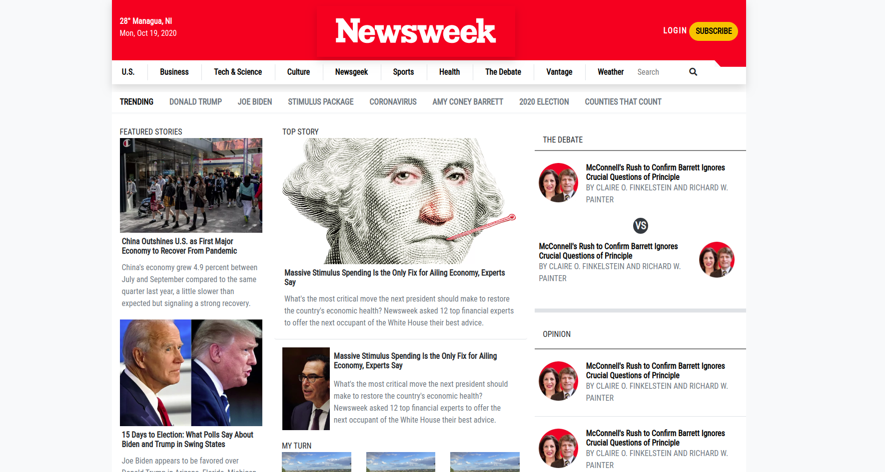

# Newsweek | Yet Another Clone - A Microverse Project

A clone of Newsweek landing page made for the Microverse FullStack program.
This is a responsive site and will scale as needed to different devices.

This was done for learning purposes using Bootstrap.

## Built With

- 
- 
- 

## Live Demo

[Live Demo Link](https://pointerish.github.io/NewsweekCloneMicroverse)

##  Getting Started

To run the code simply download the repository by either cloning it or 
downloading it as Zip file. Then use the old trustable browser to open the HTML file.

## Author (Actually, Cloner)

**Josias Alvarado**

- GitHub: [@pointerish](https://github.com/pointerish)
- Twitter: [@pointerish](https://twitter.com/pointerish)
- LinkedIn: [Josias Alvarado](https://www.linkedin.com/in/josias-alvarado-80901878/)

##  Contributing

Contributions, issues, and feature requests are welcome!

## Show your support

Give a ⭐️ if you like this project!

## License

This project is [MIT](./LICENSE) licensed.

## Acknowledgements

Bootstrap is nice and the people who made it are nice too. 